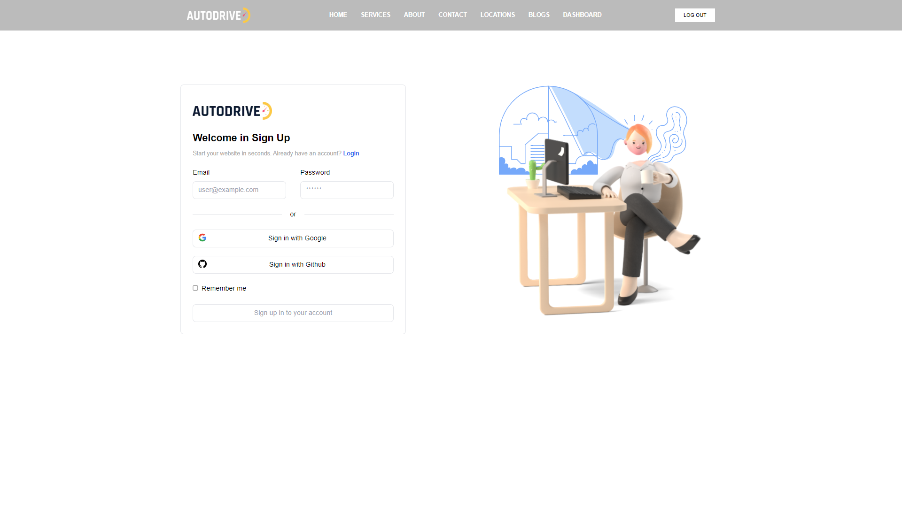

[Autodirve project live site](https://autodrive-client.vercel.app/) or [https://autodrive-client.vercel.app/](https://autodrive-client.vercel.app/)

[Client side code link](https://github.com/amirulislamhridoy/autodrive-client.git) or [https://github.com/amirulislamhridoy/autodrive-client.git](https://github.com/amirulislamhridoy/autodrive-client.git)

[Server side code Link](https://github.com/amirulislamhridoy/autodrive-server.git) or [https://github.com/amirulislamhridoy/autodrive-server.git](https://github.com/amirulislamhridoy/autodrive-server.git)
## About Project
- This is an online car rental web application
- User can book car for traveling & user can propose to this company for his car rental in company. 
- Admin can cancel user booking before payment.
- User can propose for his car.

**Used Technology:** *Next Js, Firebase, Firebase Hooks, React Query, Redux, React Redux, Redux Toolkit, Swiper, React Toastify, React Hook Form, Axios, Date Fns, React Day Picker, Node Js, Express Js, MVC patttern, MongoDB, Mongoose, Dote Env*

##### Home Page Photo

##### Login Page Photo
